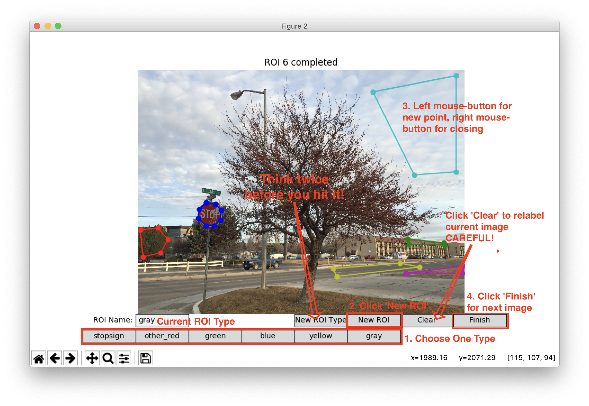
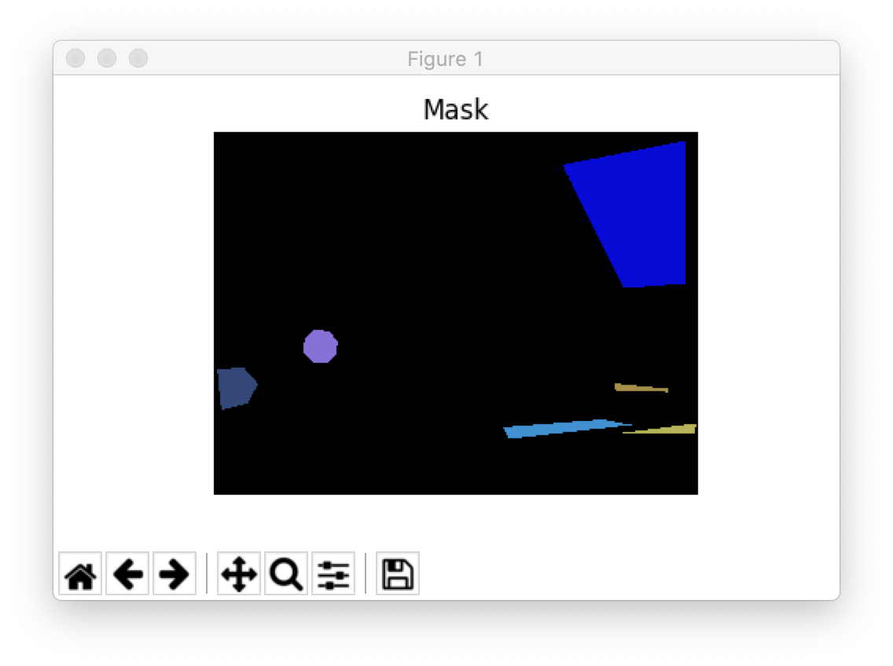

# roipoly-improved: Image ROI Labeling

## How to launch

```bash
python3 image_labeling.py --roi-type stopsign,other_red,green,blue,yellow,gray [path to your dataset]
```

**Before launching the program, make sure the train-set folder doesn't contain images you don't want to label**

### More detailed command

```bash
usage: image_labeling.py [-h] [--roi-type ROI_TYPES] [--output PICKLE_NAME] image_dir

Label image ROIs

positional arguments:
  image_dir             the directory of images to be labelled

optional arguments:
  -h, --help            show this help message and exit
  --roi-type ROI_TYPES  preload some roi types, separated by ","
  --output PICKLE_NAME  the name of pickle file contains mask

```

## How to label

Do as the following figure shows.



**If you don't hit 'Finish' before closing the windows, the current labeling result won't be saved!**

You can review the mask meanwhile. This mask is just for visual check.



## How to load result

By default, this tool saves the result to `mask.pickle`. Here is a sample Python3 code for loading the pickle file:

```python
import pickle
with open('mask.pickle', 'rb') as f:
    a = pickle.load(f)
```

Sample output:
```shell script
>>> a[0]  # image mask 
{'99.jpg': array([[0., 0., 0., ..., 0., 0., 0.],
       [0., 0., 0., ..., 0., 0., 0.],
       [0., 0., 0., ..., 0., 0., 0.],
       ...,
       [0., 0., 0., ..., 0., 0., 0.],
       [0., 0., 0., ..., 0., 0., 0.],
       [0., 0., 0., ..., 0., 0., 0.]])}
>>> a[1]  # roi types
{1: 'stopsign', 2: 'other_red', 3: 'green', 4: 'blue', 5: 'yellow', 6: 'gray'}
```

To extract the roi of specific type you want, here is a sample code:
```python
import numpy as np
import matplotlib.pyplot as plt
mask = a[0]['99.jpg']
roi = plt.imread('99.jpg')[mask == 1]  # get stopsign roi
```